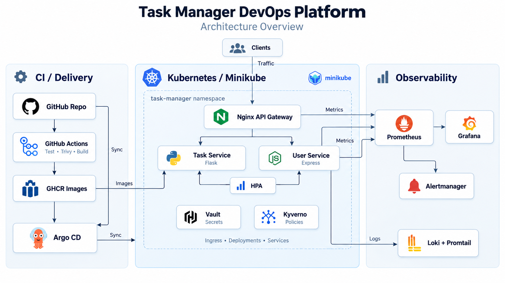
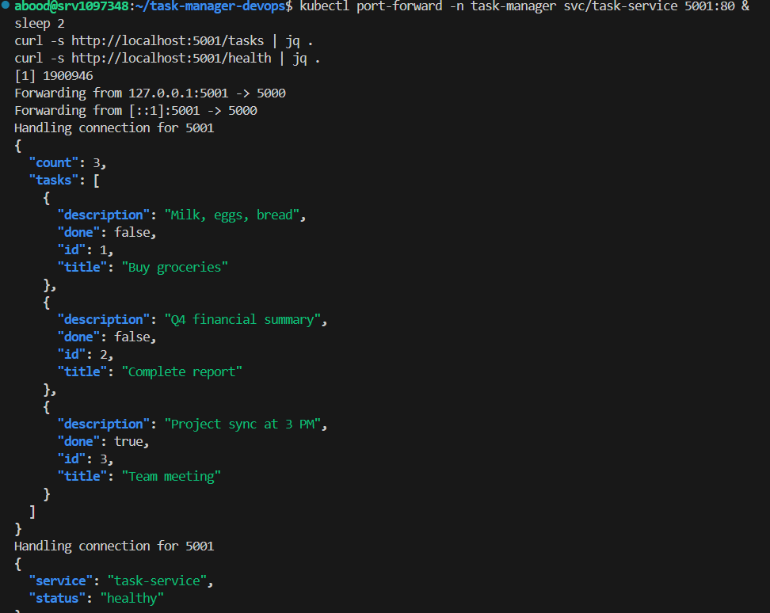
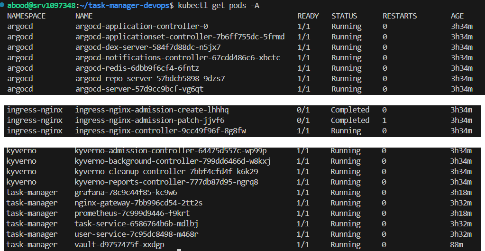
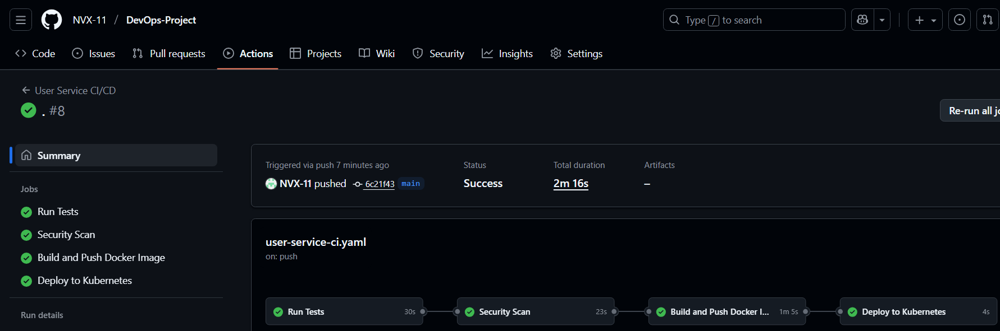
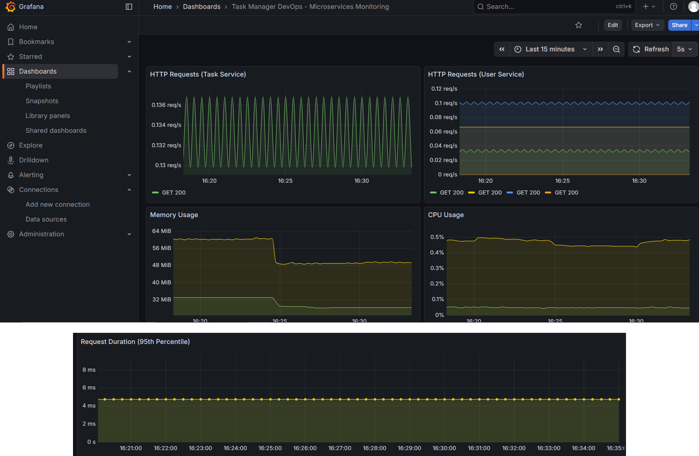
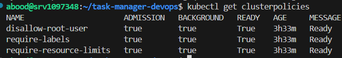

# Task Manager DevOps Platform

**Two small services, one Kubernetes cluster, and the operational layer around them.**

I built this project around a deliberately simple application. A task API in Flask and a user API in Express were enough to give me real workloads without turning the project into an application-development exercise.

The part I cared about was everything around those services: containers, CI, routing, health checks, autoscaling, metrics, logs, alerts, policy enforcement, secrets, and GitOps tooling.

This repository is the implementation record of that environment. It is **not kept running today**; the manifests, workflows, screenshots, and configuration are here as a record of what I built and tested.

---

## The architecture

The application path was straightforward:

`Clients → Nginx Gateway → Task Service / User Service`

Around that path sat the platform pieces I wanted to work with: GitHub Actions for the build pipeline, Kubernetes for runtime orchestration, Prometheus and Grafana for metrics, Loki and Promtail for logs, Alertmanager for alerts, Kyverno for policy checks, Vault for secrets experiments, and Argo CD as the GitOps component in the cluster.



### What lived where

**Application path**

Nginx was the single entry point. It routed `/api/tasks` to the Flask service and `/api/users` to the Express service.

**Kubernetes**

Both services ran inside the `task-manager` namespace with readiness and liveness probes, resource requests and limits, and HPAs that could scale each deployment from two to five replicas.

**Observability**

Prometheus discovered and scraped the application pods, Grafana visualized the metrics, Promtail shipped pod logs into Loki, and Alertmanager handled the alerting path.

---

## I kept the application intentionally small

The APIs were never supposed to be the impressive part.

The task service exposes a small CRUD API, health and readiness endpoints, and Prometheus metrics. The user service does the same in Node.js. Both use in-memory data because persistence was not the problem I was trying to solve here.

That kept the application easy to understand while still giving the platform something real to route, probe, scale, monitor, and break.



---

## Kubernetes was the actual project

This was the point where the project stopped being two small APIs and became something I found much more interesting.

The services were deployed into Minikube behind an Nginx gateway. Each deployment had explicit resource requests and limits, readiness and liveness probes, and an HPA driven by CPU and memory utilization. The cluster also included the ingress controller, Argo CD, Kyverno, Vault, and the monitoring stack.

The screenshot below is from the running environment rather than a recreated mockup.



One thing I liked about this setup was that the application stayed boring while the platform around it became the real moving part. A route change, a failed health check, a missing label, or a metrics problem could matter more than the CRUD code itself.

---

## CI was there to protect the build

The two services have separate GitHub Actions workflows.

For the Flask service, the pipeline runs pytest with coverage, scans the source with Trivy, builds the container image, publishes it to GHCR, and scans the built image for high and critical vulnerabilities.

The Node.js service follows the same basic path with npm tests, Trivy, Docker Buildx, and GHCR.



There is one detail I am leaving visible on purpose: the final deploy job in the repository is still a placeholder. Argo CD was installed and running in the environment, but this repository does **not** represent a fully closed automated path from a successful GitHub Actions run to a Kubernetes deployment.

I would rather leave that boundary honest than rewrite an old project into something it was not.

---

## Observability was the part I kept coming back to

Both services expose metrics that Prometheus can discover inside the `task-manager` namespace. The Prometheus configuration also includes alerts for service availability, CPU usage, and memory usage.

Grafana was where the environment became much easier to reason about. I could watch request activity for both services, memory and CPU behavior, and request duration instead of relying only on `kubectl` output.



For logs, Promtail ran as a DaemonSet and forwarded Kubernetes pod logs to Loki. Alertmanager was wired to separate critical and warning routes, with placeholder Slack receivers in the repository rather than real webhook credentials.

That was a useful distinction for me: metrics told me *that* something changed, while logs were where I went to understand what the service was actually doing.

---

## Guardrails around the cluster

Kyverno was there to make a few platform expectations explicit instead of leaving them as README advice.

The policies in this repository cover:

- required `app` and `version` labels on deployments
- blocking containers that run as root
- checking CPU and memory requests and limits
- generating a default-deny ingress NetworkPolicy for new namespaces



Vault was also deployed inside the lab, but deliberately in development mode. I used it to work through the secret-management flow, not to pretend a single-node dev Vault with a root token was a production secrets platform.

---

## Terraform was the bootstrap layer

Terraform has a different role here than it does in my cloud projects.

Instead of provisioning AWS or Azure resources, it wraps the local lab setup: starting Minikube, enabling the metrics-server and ingress addons, installing Kyverno and Argo CD, and building the two service images.

That made the setup repeatable, but it also showed me where Terraform starts feeling more like an orchestration wrapper than infrastructure modeling. I would make different choices for a long-lived environment today, but I am keeping the implementation because it reflects how I approached the problem at the time.

---

## What made this harder than I expected

Installing individual tools was usually the easy part.

The harder part was getting their assumptions to line up. Prometheus needed the right pod labels and annotations. HPA needed usable resource metrics. Nginx needed stable service names and ports. Kyverno policies had to match the objects being deployed. Logging needed access to the right container log paths. Every extra component created another boundary that had to agree with the rest of the cluster.

That changed the way I looked at platform work. The value was not in having a long list of tools in the repository.

> **The more tooling I added, the less the project was about installing tools and the more it was about getting their assumptions to line up.**

---

## Repository map

```text
.github/workflows/
├── task-service-ci.yaml        Flask test, scan, build and publish
└── user-service-ci.yaml        Node.js test, scan, build and publish

services/
├── task-service/               Flask API, tests and Dockerfile
└── user-service/               Express API, tests and Dockerfile

kubernetes/
├── task-service/               Deployment, Service and HPA
├── user-service/               Deployment, Service and HPA
├── nginx/                      API gateway configuration
├── monitoring/                 Prometheus, Grafana, Loki and Alertmanager
├── vault/                      Development Vault deployment
├── kyverno/                    Cluster policies
├── ingress.yaml
└── namespace.yaml

terraform/
└── main.tf                     Local Minikube and platform bootstrap

docs/
├── grafana-dashboard.json
└── images/
    ├── architecture.png
    ├── ci-pipeline.png
    ├── kubernetes-platform-running.png
    ├── kyverno-policies.png
    ├── observability-dashboard.png
    └── task-service-api-response.png

docker-compose.yaml              Smaller local Docker setup
```

---

## A note on the current repository

This is a **portfolio record of a completed local Kubernetes lab**, not a maintained production environment and not a claim that every dependency or manifest should be used unchanged today.

Some choices are intentionally visible as they were during the project: Minikube, in-memory application data, dev-mode Vault, `latest` image tags in parts of the lab, and an unfinished deployment handoff in GitHub Actions.

I am keeping those details visible because the useful part of this repository is the platform I built, the environment I actually ran, and what I learned from connecting the pieces — not polishing the history until it looks like a production system that never existed.
